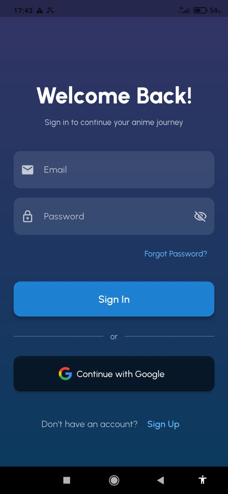
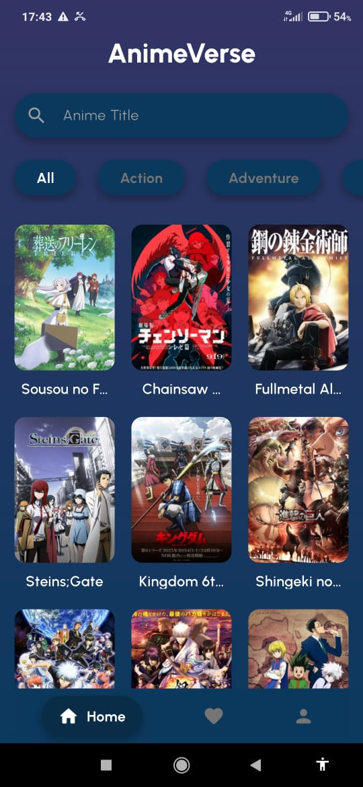
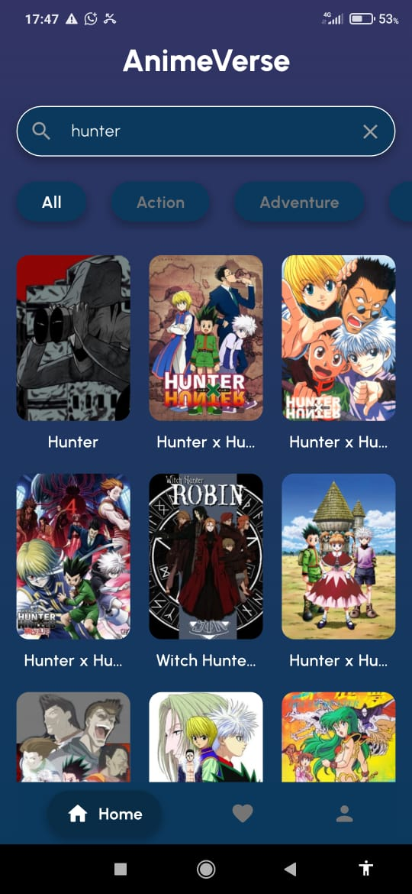
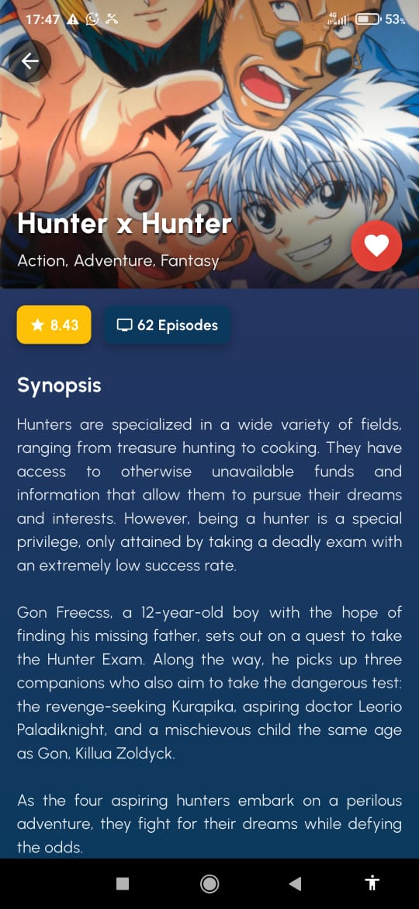
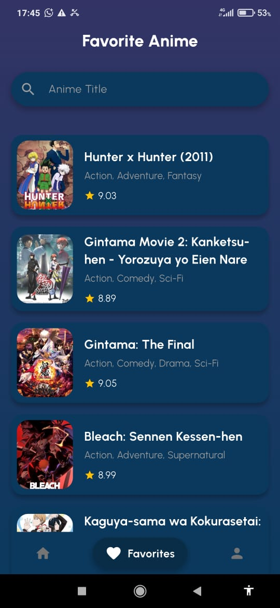
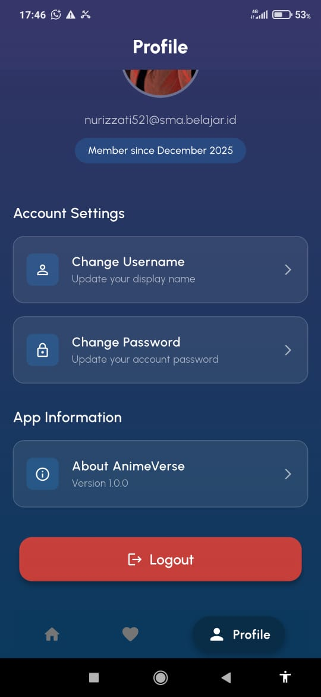
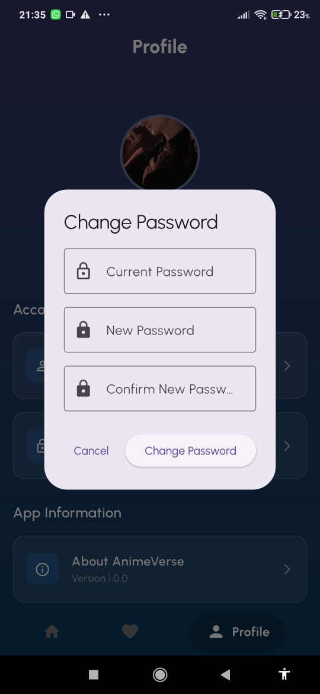

<div align="center">
  
  <h1>Anime Verse</h1>
  <p><strong>Lab Praktikum Pemrograman Mobile 2 - 2025</strong></p>
  
  <p>
    <a href="https://github.com/alizzati/AnimVerse_Izzati/releases/tag/v1.0.0">
      
    </a>
  </p>
</div>

---

## 📖 Tentang Aplikasi

**Anime Verse** adalah aplikasi mobile berbasis Flutter yang dikembangkan sebagai tugas akhir praktikum. Aplikasi ini memungkinkan pengguna untuk menjelajahi ribuan koleksi anime, mencari judul spesifik, memfilter berdasarkan genre, serta menyimpan anime favorit mereka ke dalam database cloud yang aman.

Aplikasi ini terintegrasi dengan **Jikan API (MyAnimeList)** untuk data anime dan **Firebase** untuk autentikasi serta penyimpanan data pengguna.

---

## About Me

| Nama | Nur Aliza Izzati |
| :--- | :--- |
| **NIM** | 231401076 |
| **Kom** | A |
| **Lab** | 2 |
| **Asisten Lab** | Rivaldo Dominggos Pardede |

---

## 📥 Download & Demo

- **📱 Download APK:** [Klik disini untuk Download APK (v1.0.0)](https://github.com/alizzati/AnimVerse_Izzati/releases/tag/v1.0.0)
- **🎥 Video Demo:** [Lihat Video Demo Aplikasi](https://youtu.be/drBOQq122Xk?si=r4eN9rXG5g9eRD3k)

---

## ✨ Fitur Utama

### 🔐 1. Autentikasi (Firebase Auth)
- **Sign Up & Sign In:** Login aman menggunakan Email & Password.
- **Google Sign-In:** Login cepat menggunakan akun Google (SSO).
- **Forgot Password:** Fitur reset kata sandi via email.
- **Auto Login:** Menyimpan sesi pengguna (Persistensi).

### 🔍 2. Anime Discovery (API Integration)
- **Browse Anime:** Menampilkan daftar anime populer dengan sistem *Pagination* (Load More) agar aplikasi ringan.
- **Search:** Pencarian anime berdasarkan judul secara real-time.
- **Filter Genre:** Menyaring anime berdasarkan kategori (Action, Romance, Fantasy, dll).

### ❤️ 3. Favorit (Cloud Firestore)
- **Add to Favorite:** Menyimpan anime ke daftar pribadi.
- **Real-time Database:** Data tersimpan di Cloud Firestore dengan *Security Rules* (User-Scoped), memastikan data aman dan terpisah antar pengguna.
- **Remove Favorite:** Menghapus anime dari daftar favorit.

### 👤 4. Manajemen Profil
- **Profile Info:** Menampilkan foto dan email pengguna.
- **Change Password:** Mengganti kata sandi akun.
- **Logout:** Keluar dari aplikasi dengan aman.

---

## 📸 Screenshots Aplikasi

Berikut adalah tampilan antarmuka aplikasi Anime Verse:

| Login & Register | Home Page | Search & Filter |
| :---: | :---: | :---: |
|  |  |  |
| *Halaman Login* | *Halaman Utama* | *Pencarian & Filter* |

| Detail Anime | My Favorites | Profile |
| :---: | :---: | :---: |
|  |  |  |
| *Detail Info* | *List Favorit* | *Profil User* |

| Change Password |
| :---: |
|  |
| *Change Password* |
---

## 🛠️ Teknologi yang Digunakan

- **Framework:** Flutter (Dart)
- **Backend:** Firebase (Authentication, Cloud Firestore)
- **API:** Jikan API v4 (Unofficial MyAnimeList API)
- **State Management:** Provider
- **Local Storage:** Shared Preferences (untuk caching token/tema)

---

## 🏗️ Cara Instalasi (Untuk Developer)

Jika Anda ingin menjalankan source code ini di komputer lokal:

1. **Clone Repository**
   ```bash
   git clone https://github.com/alizzati/AnimVerse_Izzati.git
   cd AnimVerse_Izzati
2. **Install Dependencies**
   ```bash
   flutter pub get
   ```
3. **Konfigurasi Firebase**
   - Pastikan file `google-services.json` sudah diletakkan di folder `android/app/`.
   - Pastikan SHA-1 Fingerprint sudah didaftarkan di Firebase Console.
     
4. **Jalankan Aplikasi**
   ```bash
    flutter run
    ```
